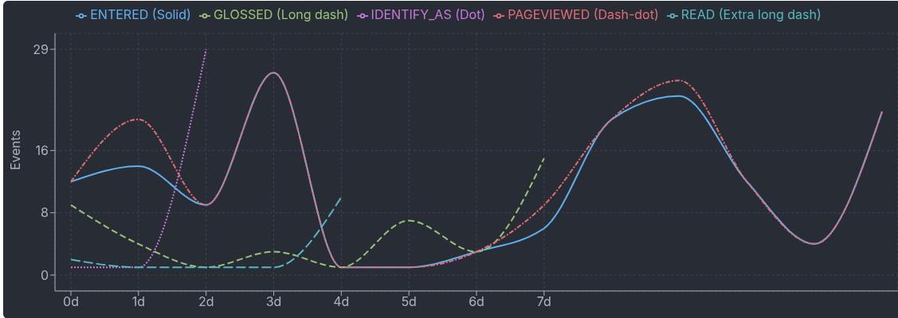

## Log-in

To access your site visit https://hello.tractstack.com/storykeep (use your URL; go to /storykeep path).

## Dashboard

Manage your Tract Stack at a glance. Your dashboard has three sections:

### Out-of-the-box engagement analytics

Every section of every web page is a touch point to engage your audience. This works automatically and without any additional configuration.

Analytics are shown for past 24 hours, 7 days, or 4 weeks.

### Browse Pages

Your site content is easily discoverable. Pages with custom open graph images will shown.

Use the `Sort by Most Active` toggle to see which pages are getting the most recent activity.

### Manage Content

**Special Content:**

- Images: site-wide registry of images uploaded
- Menus: create custom menus
- Resources: custom content types especially for dynamic elements like an itinerary or recommended readings widget
- Tract Stacks: carefully craft how your site analytics will be gathered

**Epistemic Hypermedia:**

- Magic Path Beliefs: define how visitors can engage dynamically with your content

**Create New:**

- Create menu, resource, tract stack, web page (storyfragment), context page
