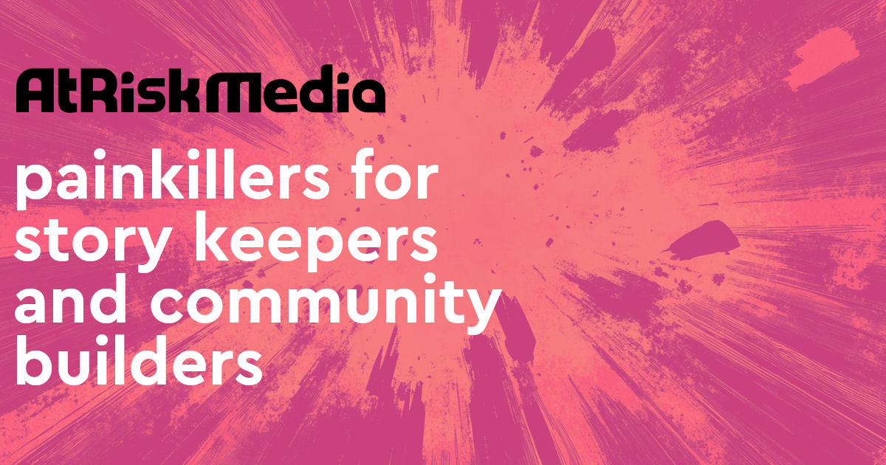

Our MISSION:

redeeming stale, static and boring websites through better website software

we build (and share) modern web publishing tools for making high engagement and community-focused websites

_check out some websites built with our software..._

### At Risk Media

Simple landing page website. Collects emails / newsletter sign-ups.

[https://atriskmedia.com](https://atriskmedia.com)

### Tract Stack

Our flagship "website maker"

[https://tractstack.com](https://tractstack.com)

### Touching Toronto

Ministry began in July 2011 to see the Greater Toronto Area touched and influenced by the power of the Holy Spirit and through miracles.

[https://touchingtoronto.com](https://touchingtoronto.com)

### Sneakypedia

Sneaky Productions creates hand-drawn collectable trading cards and physical products linked by story and lore to blockchain NFTs (digital art).

They represent an incredible and vibrant community but needed a place for fans to discover the art and lore.

Check out [Making Sneakypedia](/examples/sneakypedia) for this unfolding story.

